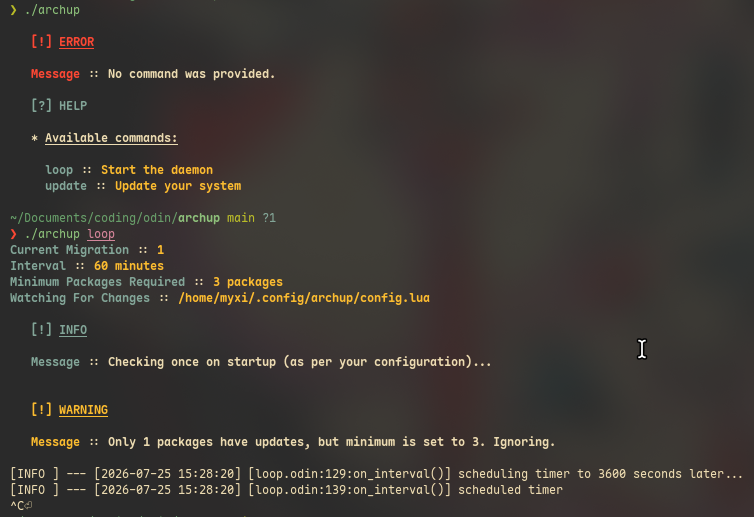
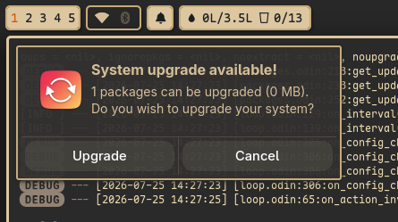
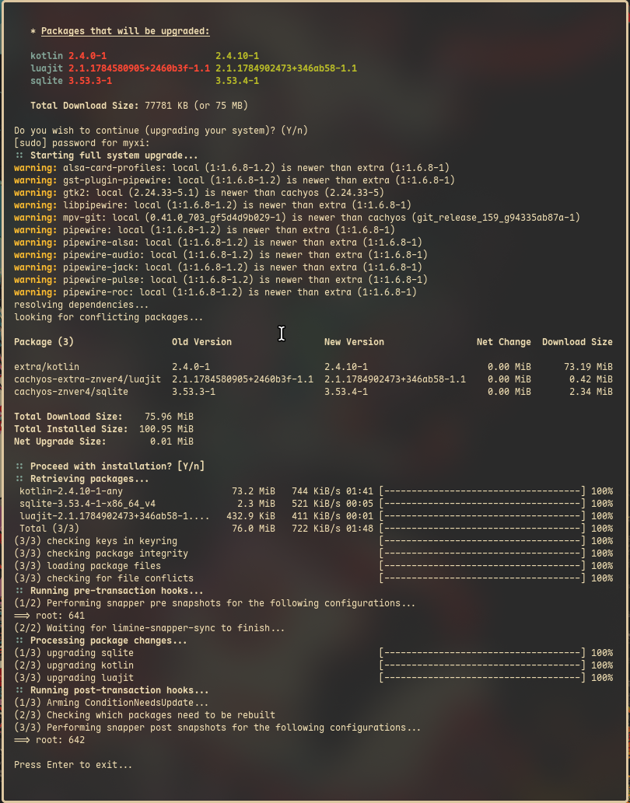
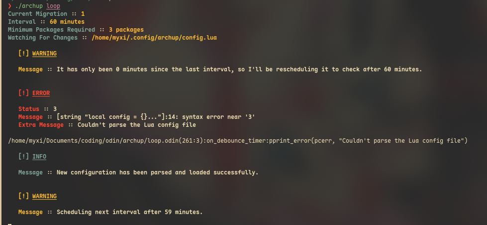

# Archup
A snappy, lightweight, highly-customizable system upgrade helper daemon for
Arch systems.

Archup doesn't require root access or init systems (like Systemd) setup to
function. It only asks for root permission when you hit "Upgrade" button.

Powered by [Odin](https://odin-lang.org/), a low level programming language and
an alternative to C.

It has advanced features like calculating _remaining_ time since last notification and starting the scheduler based on that on startup. So that you don't have to worry about accidental or deliberate shutdowns of your system.

# Screenshots




# Configuration File
Configuration is done through a Lua file stored at `$HOME/.config/archup/config.lua`.

```lua
local config = {}

local file, err = io.open("/etc/pacman.conf", "r")
if file then
  config.pacman_config_content = file:read("*all") .. "[options]\nParallelDownloads = 1\n"
  file:close()
else
  config.pacman_config_content = err
end

config.interval = 2 * 60
config.terminal_prefix = {"ghostty", "--title=Archup Popup", "-e"}
config.check_on_startup = true
config.minimum_n_packages = 3

return config
```

`config.interval` is the interval to check for updates **in minutes**.
> [!CAUTION]
> Archup **doesn't** block the timer for checking for upgrades. It is
> immediately restarted after sending you the notification. Please avoid short
> intervals.

`config.terminal_prefix` is a list of strings which will acts as the prefix of
the command-line argument list to open a terminal. The suffix that Archup will
append to this list is the process it would like to spawn. The suffix would
usually be something like `["sh", "-c", "..."]`, so `{"ghostty",
"--title=Archup Popup", "-e", "sh", "-c", "..."}` would be the final list which
would be spawned.

`config.pacman_config_content` is a Lua string which should contan the Pacman
config you'd like the user to use with Pacman. You can use this field to
override certain system configurations like parallel downloads.

`config.check_on_startup` is a boolean dictating whether or not Archup would
immediately check for upgrades on startup.

`config.minimum_n_packages` is a number which represents the minimum count of
packages that must be met for Archup to consider worth upgrading.

The daemon smartly checks for changes to the Config file and reloads on the
fly. It also tells you about errors in your Lua config file.


# Installation
<!-- @TODO: Add GitHub CI script to release prebuilt binaries. -->

No prebuilt binaries yet. Please build it yourself.

Required packages: `odin`, `pacutils`, `sqlite`, `systemd`, `pacman`, `fish`

> [!NOTE]
> I personally run the master branch of Odin. It might not compile with the
> latest tagged release.

It also links against:
- `systemd` for: `sdbus`, `sdevent`
- `alpm` for: `alpm`

`fish` is required to run [`generate-bindings.fish`](generate-bindings.fish)
script.

Clone with:
```bash
git clone --recurse-submodules https://github.com/eeriemyxi/archup
```

Then run:
```bash
./generate-bindings.fish
odin build .
```

There are a number of defines for debugging purposes:
```bash
odin run . -debug -sanitize:address \
  -define:D_FAST_RESCHEDULE=false \
  -define:D_FAST_RTIME=4 \
  -define:D_EXIT_EVENT_ON_CANCEL=true \
  -define:D_URGENCY=2 \
  -define:D_DISABLE_SYNC=true \
  -- -log-level:Debug loop
```
